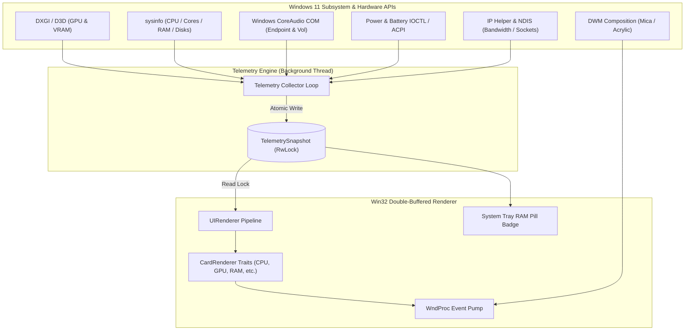

<div align="center">

# ⚡ Sidebar Native

### *Ultra-Lightweight, Native Windows 11 Diagnostics Flyout in Pure Rust*

[](https://www.rust-lang.org/)
[](https://microsoft.com/windows)
[]()
[]()
[](LICENSE)

<br/>

**Sidebar Native** is a blazing-fast, resource-efficient system diagnostics monitor and flyout built exclusively for Windows 11 and Windows 10. Written in 100% pure Rust with direct Win32 and DWM APIs, it delivers real-time hardware telemetry with gorgeous Mica/Acrylic materials, fluid animations, and zero runtime bloat.

[Key Features](#-key-features) • [Quick Start](#-quick-start) • [UI & Theming](#-ui-materials--theming) • [Controls & Shortcuts](#-controls--hotkeys) • [Configuration](#-configuration) • [Architecture](#-architecture)

---

</div>

<br/>

## 🎯 Why Sidebar Native?

Traditional hardware monitors and desktop widgets rely heavily on web frameworks (Electron, WebView2, Chromium) or heavy runtimes, frequently consuming **150 MB – 400 MB of RAM** and noticeable background CPU cycles.

**Sidebar Native** is engineered from the ground up for maximum efficiency and native Windows integration:

| Metric | Sidebar Native (Rust) | Electron / Web-based Monitors |
| :--- | :--- | :--- |
| **Idle Memory (RAM)** | **`< 8 MB`** | `180 MB – 450 MB` |
| **Idle CPU Usage** | **`< 0.1%`** | `1.5% – 5.0%` |
| **Render Engine** | **Win32 Double-Buffered GDI / DWM** | Chromium / V8 Web Engine |
| **Frametime / Paint** | **`~300 µs` (Sub-millisecond)** | `16 ms – 33 ms` |
| **Startup Time** | **Instant (`< 20 ms`)** | `1.5 s – 4.0 s` |
| **Gaming Friendly** | **Auto-pauses on fullscreen / games** | Background polling continues |

<br/>

---

## ✨ Key Features

```
┌────────────────────────────────────────────────────────┐
│  DIAGNOSTICS                                       [✕] │
├────────────────────────────────────────────────────────┤
│  🖥️  DESKTOP-WIN11                       10:42:18 AM   │
│     Windows 11 Pro                    Monday, Aug 31   │
├────────────────────────────────────────────────────────┤
│  ⚡ PROCESSOR (CPU)                             18.4%  │
│     AMD Ryzen 9 5900X 12-Core @ 4.20 GHz       49 °C   │
│     [■■■□□□□□] Core Load Heatmap                       │
├────────────────────────────────────────────────────────┤
│  🎮 GRAPHICS (GPU)                              24.0%  │
│     NVIDIA GeForce RTX 3080                  52 °C     │
│     VRAM: 3.2 GB / 10.0 GB • Shared: 1.1 GB / 16.0 GB  │
├────────────────────────────────────────────────────────┤
│  🔊 AUDIO PLAYBACK                              72%    │
│     Realtek High Definition Audio (Active)             │
├────────────────────────────────────────────────────────┤
│  💾 SYSTEM MEMORY (RAM)                         42.1%  │
│     Physical: 13.5 GB / 32.0 GB                        │
│     Virtual / Pagefile: 16.2 GB / 36.0 GB              │
├────────────────────────────────────────────────────────┤
│  💽 STORAGE & DRIVES                                   │
│     (C:) NVMe SSD — 450 GB Free / 1.0 TB  (▲ 24 MB/s)  │
│     (D:) SATA SSD — 1.2 TB Free / 2.0 TB               │
│     (WSL) Ubuntu Linux Ext4 Virtual Disk               │
├────────────────────────────────────────────────────────┤
│  🌐 NETWORK I/O                                        │
│     Wi-Fi 6 (192.168.1.120)       ↓ 4.2 MB/s  ↑ 520 KB │
├────────────────────────────────────────────────────────┤
│  🔥 POWER & BATTERY                             94%    │
│     Plugged in (Charging) • +45.2 W • Health: 98.2%    │
├────────────────────────────────────────────────────────┤
│  📊 TOP PROCESSES (CPU / RAM / DISK / NET)             │
│     • chrome.exe        12.4% CPU  │ 1.4 GB RAM        │
│     • code.exe           4.2% CPU  │ 620 MB RAM        │
│     • rustc.exe          8.1% CPU  │ 1.1 GB RAM        │
└────────────────────────────────────────────────────────┘
```

### 🔍 Comprehensive Telemetry Engine

* **⚡ Processor (CPU)**: Real-time global utilization, clock speed in GHz/MHz, per-core utilization breakdown with dynamic load heatmaps, and package temperature (°C/°F).
* **🎮 Graphics (GPU)**: Multi-GPU discovery (NVIDIA, AMD Radeon, Intel Arc/Iris/UHD), Dedicated VRAM usage and capacity, Shared System Memory allocation, and low-power registry enumeration for standby dGPUs (`D3Cold`).
* **🔊 Audio Endpoint**: Active Windows default playback device name, master volume percentage, and live mute indicator.
* **💾 System Memory (RAM) & Pagefile**: Physical RAM utilization, committed virtual memory, swap/page file metrics, and dynamic taskbar badge.
* **💽 Storage & Disks**: Physical drives, NVMe SSDs, SATA disks, removable/optical media, and WSL2 Linux (`ext4`) virtual disks with real-time read/write throughput rates.
* **🌐 Network Activity**: Live download/upload bandwidth, total session bytes transferred, active adapter detection, and local IPv4 address resolution.
* **🔋 Power & Battery**: Battery charge percentage, AC power connection status, charging/discharging wattage flow rate, terminal voltage, health & wear degradation percentage, charge cycle count, and remaining battery life estimate.
* **📊 Top Processes Categorization**: Live tracking of top resource consumers categorized by **CPU Usage**, **RAM Memory**, **Disk I/O Throughput**, and **Active Network Sockets (TCP/UDP)**.
* **🌡️ Sensors & Hardware Explorer**: ACPI thermal zones, motherboard sensor readings, and optional discovery of offline/standby devices.

<br/>

---

## 🎨 UI Materials & Theming

Sidebar Native seamlessly blends into Windows 11 with authentic DWM materials and high-precision typography:

### 🪟 Windows 11 Materials
* **Mica**: Subtle dynamic tinting matching desktop wallpaper.
* **Acrylic**: Soft frosted-glass blur background.
* **Mica Alt**: High-contrast tabbed material.
* **Solid / None**: Clean solid canvas for minimal distraction.

### 🎭 Color Palettes
* **Auto (System Sync)**: Automatically adapts to your Windows light/dark system setting.
* **Dark Slate**: Modern slate-gray Windows 11 dark mode.
* **Light Clean**: Crisp, high-contrast light theme.
* **OLED Midnight Black**: True `#000000` pitch black for OLED displays.
* **Nord Arctic**: Cool glacier blue and arctic slate.
* **Cyberpunk Neon**: High-contrast electric cyan, neon magenta, and amber accents.

### 📐 High-DPI & Scaling
* **Per-Monitor High-DPI V2 Awareness**: Pixel-perfect rendering across multiple monitors with varying scaling factors (100%, 125%, 150%, 175%, 200%).
* **Font Scaling Presets**: Small (100%), Medium (120%), Large (145% - Default), Extra Large (170%), Huge (200%).
* **Window Width Presets**: Compact (350px), Standard (410px), Wide (490px), Ultra-Wide (580px), or freely resizable using the 8px border handles.

<br/>

---

## 🚀 Quick Start

### Prerequisites
* **Windows 11** (recommended) or **Windows 10** (build 1809+)
* **Rust 1.75+** with the MSVC toolchain (`rustup default stable-x86_64-pc-windows-msvc`)

### Build & Run

1. **Clone the repository:**
   ```bash
   git clone https://github.com/your-username/sidebar-native.git
   cd sidebar-native
   ```

2. **Run in debug mode:**
   ```bash
   cargo run
   ```

3. **Build the optimized release binary:**
   ```bash
   cargo build --release
   ```
   The ultra-compact binary will be generated at `target/release/sidebar-native.exe` (stripped with Link-Time Optimization enabled).

<br/>

---

## ⌨️ Controls & Hotkeys

| Action | Shortcut / Gesture | Description |
| :--- | :--- | :--- |
| **Toggle Flyout** | <kbd>Ctrl</kbd> + <kbd>Alt</kbd> + <kbd>S</kbd> | Instantly shows or hides the diagnostics sidebar. |
| **System Tray Click** | `Left Click` on Tray Icon | Toggles the flyout visibility. |
| **Context Menu** | `Right Click` on Tray Icon | Opens settings for themes, cards, materials, widths, and options. |
| **Scroll Content** | `Mouse Wheel` | Smoothly scrolls through telemetry cards. |
| **Move Window** | `Click & Drag` Top Header | Freely positions the flyout anywhere on screen. |
| **Dismiss Flyout** | `Click [✕]` Button | Hides the flyout back to the system tray. |
| **Resize Flyout** | `Drag Window Borders` | 8-pixel hitboxes allow freeform window resizing. |

<br/>

---

## ⚙️ Configuration

Sidebar Native stores its settings in a clean, human-readable JSON configuration file at:
```
%APPDATA%\SidebarNative\config.json
```

You can open and edit this file anytime directly via the Tray Menu (**Right Click Tray** → **Open Config File**).

### Example `config.json`

```json
{
  "poll_interval_ms": 1000,
  "dock_edge": "Right",
  "sidebar_width": 490,
  "width_preset": "Wide",
  "stay_on_top": true,
  "click_through": false,
  "show_tray_icon": true,
  "run_at_startup": false,
  "initially_hidden": false,
  "auto_pause_fullscreen": true,
  "theme": "Auto",
  "backdrop": "Mica",
  "font_size": "Large",
  "bg_opacity": 0.92,
  "show_machine_name": true,
  "show_clock": true,
  "clock_24hr": false,
  "date_format": "Normal",
  "temperature_unit": "Celsius",
  "use_ghz": true,
  "use_bytes": true,
  "show_core_loads": true,
  "sort_processes_by": "Cpu",
  "show_top_cpu": true,
  "show_top_ram": true,
  "show_top_disk": true,
  "show_top_network": true,
  "process_limit_per_category": 4,
  "show_cpu": true,
  "show_gpu": true,
  "show_ram": true,
  "show_storage": true,
  "show_network": true,
  "show_audio": true,
  "show_processes": true,
  "show_virtual_memory": true,
  "show_battery": true,
  "show_system_overview": true,
  "show_sensors_card": true,
  "show_disabled_hardware": true,
  "show_all_sensors": true,
  "show_all_gpus": true,
  "show_gpu_shared_memory": true,
  "show_gpu_temperatures": true
}
```

<br/>

---

## 🏗️ Architecture

Sidebar Native is designed around clean **SOLID software architecture**, ensuring thread safety, modularity, and zero garbage collection overhead:



### Key Architectural Tenets
* **Open-Closed Principle (OCP)**: Hardware collectors implement the `TelemetryCollector` trait, and UI cards implement the `CardRenderer` trait—new cards and collectors can be added without modifying the core pipeline.
* **Single Responsibility (SRP)**: Hardware polling runs on a dedicated background thread isolated from the Win32 window message pump.
* **Thread Safety**: Snapshot synchronization uses an `Arc<RwLock<TelemetrySnapshot>>` with atomic flags for instant, lock-free UI paints.
* **Single Instance**: Protected by a global named Win32 Mutex (`Local\SidebarDiagnosticsNativeMutex`).

<br/>

---

## 🧪 Testing

The test suite covers configuration serialization, process ranking algorithms, drive filesystem detection (including WSL2 Linux `ext4`), and battery health metrics:

```bash
cargo test
```

<br/>

---

## 📜 License

This project is licensed under the **MIT License**. See the [LICENSE](LICENSE) file for details.

<br/>

<div align="center">
  <sub>Built with ❤️ and Rust for Windows power users.</sub>
</div>

