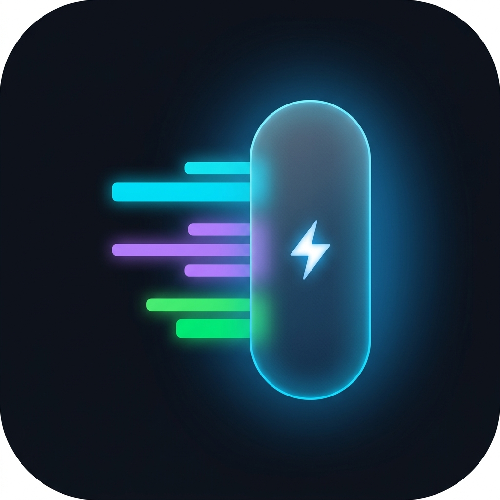
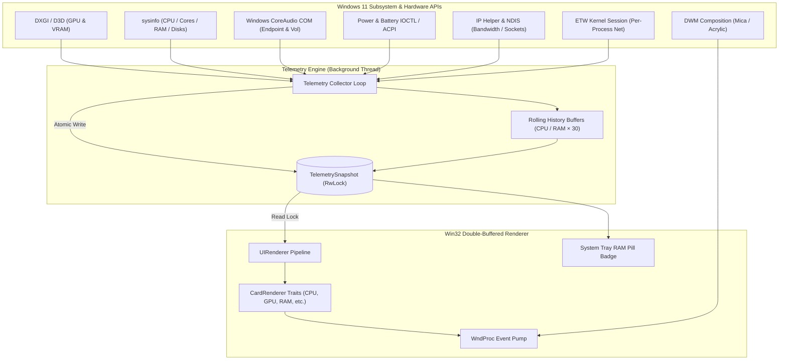

<div align="center">



# ⚡ SideVitals

### *Ultra-Lightweight, Native Windows 11 Diagnostics & Telemetry Flyout in Pure Rust*

[](https://www.rust-lang.org/)
[](https://microsoft.com/windows)
[](https://github.com/chiku-sourav/sidebar-native/actions/workflows/build-release.yml)
[](https://github.com/chiku-sourav/sidebar-native/actions/workflows/lint.yml)
[]()
[]()
[](LICENSE)

<br/>

**SideVitals** is a blazing-fast, resource-efficient system diagnostics monitor and flyout built exclusively for Windows 11 and Windows 10. Written in 100% pure Rust with direct Win32 and DWM APIs, it delivers real-time hardware telemetry with gorgeous Mica/Acrylic materials, fluid animations, and zero runtime bloat.

[Key Features](#-key-features) • [Quick Start](#-quick-start) • [UI & Theming](#-ui-materials--theming) • [Controls & Shortcuts](#-controls--hotkeys) • [Configuration](#-configuration) • [Architecture](#-architecture)

---

</div>

<br/>

## 🎯 Why SideVitals?

Traditional hardware monitors and desktop widgets rely heavily on web frameworks (Electron, WebView2, Chromium) or heavy runtimes, frequently consuming **150 MB – 400 MB of RAM** and noticeable background CPU cycles.

**SideVitals** is engineered from the ground up for maximum efficiency and native Windows integration:

| Metric | SideVitals (Rust) | Electron / Web-based Monitors |
| :--- | :--- | :--- |
| **Idle Memory (RAM)** | **`< 8 MB`** | `180 MB – 450 MB` |
| **Idle CPU Usage** | **`< 0.1%`** | `1.5% – 5.0%` |
| **Render Engine** | **Win32 Double-Buffered GDI / DWM** | Chromium / V8 Web Engine |
| **Frametime / Paint** | **`~300 µs` (Sub-millisecond)** | `16 ms – 33 ms` |
| **Startup Time** | **Instant (`< 20 ms`)** | `1.5 s – 4.0 s` |
| **Gaming Friendly** | **Auto-pauses on fullscreen / games** | Background polling continues |

<br/>

---

## ✨ Key Features

```
┌────────────────────────────────────────────────────────┐
│  DIAGNOSTICS                                       [✕] │
├────────────────────────────────────────────────────────┤
│  🖥️  DESKTOP-WIN11                       10:42:18 AM   │
│     Windows 11 Pro                    Monday, Aug 31   │
├────────────────────────────────────────────────────────┤
│  ⚡ PROCESSOR (CPU)                             18.4%  │
│     AMD Ryzen 9 5900X 12-Core @ 4.20 GHz       49 °C   │
│     [■■■□□□□□] Core Load Heatmap                       │
├────────────────────────────────────────────────────────┤
│  🎮 GRAPHICS (GPU)                              24.0%  │
│     NVIDIA GeForce RTX 3080                  52 °C     │
│     VRAM: 3.2 GB / 10.0 GB • Shared: 1.1 GB / 16.0 GB  │
├────────────────────────────────────────────────────────┤
│  🔊 AUDIO PLAYBACK                              72%    │
│     Realtek High Definition Audio (Active)             │
├────────────────────────────────────────────────────────┤
│  💾 SYSTEM MEMORY (RAM)                         42.1%  │
│     Physical: 13.5 GB / 32.0 GB                        │
│     Virtual / Pagefile: 16.2 GB / 36.0 GB              │
├────────────────────────────────────────────────────────┤
│  💽 STORAGE & DRIVES                                   │
│     (C:) NVMe SSD — 450 GB Free / 1.0 TB  (▲ 24 MB/s)  │
│     (D:) SATA SSD — 1.2 TB Free / 2.0 TB               │
│     (WSL) Ubuntu Linux Ext4 Virtual Disk               │
├────────────────────────────────────────────────────────┤
│  🌐 NETWORK I/O                                        │
│     Wi-Fi 6 (192.168.1.120)       ↓ 4.2 MB/s  ↑ 520 KB │
├────────────────────────────────────────────────────────┤
│  🔥 POWER & BATTERY                             94%    │
│     Plugged in (Charging) • +45.2 W • Health: 98.2%    │
├────────────────────────────────────────────────────────┤
│  📊 TOP PROCESSES (CPU / RAM / DISK / NET)             │
│     • chrome.exe        12.4% CPU  │ 1.4 GB RAM        │
│     • code.exe           4.2% CPU  │ 620 MB RAM        │
│     • rustc.exe          8.1% CPU  │ 1.1 GB RAM        │
└────────────────────────────────────────────────────────┘
```

### 🔍 Comprehensive Telemetry Engine

* **⚡ Processor (CPU)**: Real-time global utilization, clock speed in GHz/MHz, per-core utilization breakdown with dynamic load heatmaps, package temperature (°C/°F), and rolling 30-sample usage sparkline history.
* **🎮 Graphics (GPU)**: Multi-GPU discovery (NVIDIA, AMD Radeon, Intel Arc/Iris/UHD), dedicated VRAM usage and capacity, shared system memory allocation, GPU temperatures, and low-power registry enumeration for standby dGPUs (`D3Cold`).
* **🔊 Audio Endpoint**: Active Windows default playback device name, master volume percentage, and live mute indicator.
* **💾 System Memory (RAM) & Pagefile**: Physical RAM utilization with a rolling 30-sample history sparkline, committed virtual memory, swap/page file metrics, and dynamic system tray RAM badge.
* **💿 Virtual Memory**: Dedicated card showing committed vs. available virtual address space and pagefile breakdown.
* **💽 Storage & Disks**: Physical drives, NVMe SSDs, SATA disks, removable/optical media, and WSL2 Linux (`ext4`) virtual disks with real-time read/write throughput rates (MB/s or Mbps).
* **🌐 Network Activity**: Live download/upload bandwidth, total session bytes transferred, active adapter detection, and local IPv4 address resolution.
* **🔋 Power & Battery**: Battery charge percentage, AC power connection status, charging/discharging wattage flow rate, terminal voltage, health & wear degradation percentage, charge cycle count, and remaining battery life estimate.
* **📊 Top Processes**: Live tracking of top resource consumers independently categorized by **CPU Usage**, **RAM Memory**, **Disk I/O Throughput**, and **Active Network Sockets (TCP/UDP)** — each category independently toggleable and sortable. ETW kernel-level network session provides per-process bandwidth when running as administrator.
* **🌡️ Sensors & Hardware Explorer**: ACPI thermal zones, motherboard sensor readings, and optional discovery of offline/standby devices.
* **🖥️ System Overview**: Hostname, OS version/edition display, live clock (12h/24h), and configurable date format.

<br/>

---

## 🎨 UI Materials & Theming

SideVitals seamlessly blends into Windows 11 with authentic DWM materials and high-precision typography:

### 🪟 Windows 11 Materials
* **Mica**: Subtle dynamic tinting matching desktop wallpaper.
* **Acrylic**: Soft frosted-glass blur background.
* **Mica Alt**: High-contrast tabbed material.
* **Solid / None**: Clean solid canvas for minimal distraction.

### 🎭 Color Palettes
* **Auto (System Sync)**: Automatically adapts to your Windows light/dark system setting.
* **Dark Slate**: Modern slate-gray Windows 11 dark mode.
* **Light Clean**: Crisp, high-contrast light theme.
* **OLED Midnight Black**: True `#000000` pitch black for OLED displays.
* **Nord Arctic**: Cool glacier blue and arctic slate.
* **Cyberpunk Neon**: High-contrast electric cyan, neon magenta, and amber accents.

### 📐 High-DPI & Scaling
* **Per-Monitor High-DPI V2 Awareness**: Pixel-perfect rendering across multiple monitors with varying scaling factors (100%, 125%, 150%, 175%, 200%).
* **Font Scaling Presets**: Small (100%), Medium (120%), Large (145% — Default), Extra Large (170%), Huge (200%).
* **Window Width Presets**: Compact (350px), Standard (410px), Wide (490px), Ultra-Wide (580px), or freely resizable using the 8px border handles.
* **Background Opacity**: Independently configurable `bg_opacity` (0.0–1.0) for translucency control.

<br/>

---

## 🚀 Quick Start

### Prerequisites
* **Windows 11** (recommended) or **Windows 10** (build 1809+)
* **Rust 1.75+** with the MSVC toolchain (`rustup default stable-x86_64-pc-windows-msvc`)

### Build & Run

1. **Clone the repository:**
   ```bash
   git clone https://github.com/chiku-sourav/sidebar-native.git
   cd sidebar-native
   ```

2. **Run in debug mode:**
   ```bash
   cargo run
   ```

3. **Build the optimized release binary:**
   ```bash
   cargo build --release
   ```
   The ultra-compact binary will be generated at `target/release/sidevitals.exe` (stripped with Link-Time Optimization enabled).

> **Note**: For per-process network bandwidth tracking, run the application as **Administrator** to allow the ETW kernel-network session to start.

<br/>

---

## ⌨️ Controls & Hotkeys

| Action | Shortcut / Gesture | Description |
| :--- | :--- | :--- |
| **Toggle Flyout** | <kbd>Ctrl</kbd> + <kbd>Alt</kbd> + <kbd>S</kbd> | Instantly shows or hides the diagnostics flyout. |
| **System Tray Click** | `Left Click` on Tray Icon | Toggles the flyout visibility. |
| **Context Menu** | `Right Click` on Tray Icon | Opens the full settings menu. |
| **Scroll Content** | `Mouse Wheel` | Smoothly scrolls through telemetry cards. |
| **Move Window** | `Click & Drag` Top Header | Freely positions the flyout anywhere on screen. |
| **Dismiss Flyout** | `Click [✕]` Button | Hides the flyout back to the system tray. |
| **Resize Flyout** | `Drag Window Borders` | 8-pixel hitboxes allow freeform window resizing. |

<br/>

---

## 🖱️ Tray Context Menu

Right-clicking the system tray icon opens a rich context menu with the following submenus. All changes apply **instantly** and persist automatically to `config.json`:

| Submenu | Options |
| :--- | :--- |
| **Theme** | Auto (System Sync), Dark Slate, Light Clean, OLED Midnight Black, Nord Arctic Slate, Cyberpunk Neon |
| **Font Size & Scale** | Small (100%), Medium (120%), Large (145%), Extra Large (170%), Huge (200%) |
| **Backdrop Material** | Mica, Acrylic Blur, Mica Alt (Tabbed), Solid / None |
| **Window Width & Size** | Compact (350px), Standard (410px), Wide (490px), Ultra Wide (580px) |
| **Polling Interval** | 500 ms (Fast), 1.0 s (Default), 2.0 s, 3.0 s, 5.0 s (Low Power) |
| **Clock & Date Header** | Toggle clock, 12h/24h format, computer name/OS, date format (Disabled / Short / Normal / Long) |
| **Units & Display** | Temperature °C/°F, CPU clock GHz/MHz, network & disk bytes or bits, per-core grid toggle, per-category process visibility, process sort order |
| **Monitors & Cards** | Individual toggle for every card: CPU, GPU, Audio, RAM, Storage, Network, Processes, Virtual Memory, Battery, System Overview, Sensors Explorer; GPU multi-enum, shared memory breakdown, disabled hardware discovery |
| **Window & Behavior** | Run at Windows Startup, Auto-Pause on Fullscreen/Games, Always On Top, Caffeine Mode (Prevent Sleep) |
| **Open Config File** | Opens `%APPDATA%\SideVitals\config.json` in your default editor |
| **Open Debug Log** | Opens `%APPDATA%\SideVitals\sidevitals.log` for diagnostics |
| **About / Exit** | About dialog and clean exit |

<br/>

---

## ⚙️ Configuration

SideVitals stores its settings in a clean, human-readable JSON configuration file at:
```
%APPDATA%\SideVitals\config.json
```

You can open and edit this file anytime directly via the Tray Menu (**Right Click Tray** → **Open Config File**). All settings take effect on the next poll cycle without requiring a restart.

### Example `config.json`

```json
{
  "poll_interval_ms": 1000,
  "dock_edge": "Right",
  "sidebar_width": 480,
  "width_preset": "Wide",
  "stay_on_top": true,
  "show_tray_icon": true,
  "run_at_startup": false,
  "initially_hidden": false,
  "auto_pause_fullscreen": false,
  "caffeine_enabled": false,
  "theme": "Auto",
  "backdrop": "Mica",
  "font_size": "Large",
  "bg_opacity": 0.92,
  "show_machine_name": true,
  "show_clock": true,
  "clock_24hr": false,
  "date_format": "Normal",
  "temperature_unit": "Celsius",
  "use_ghz": true,
  "use_bytes": true,
  "show_core_loads": true,
  "sort_processes_by": "Cpu",
  "show_top_cpu": true,
  "show_top_ram": true,
  "show_top_disk": true,
  "show_top_network": true,
  "process_limit_per_category": 4,
  "show_cpu": true,
  "show_gpu": true,
  "show_ram": true,
  "show_storage": true,
  "show_network": true,
  "show_audio": true,
  "show_processes": true,
  "show_virtual_memory": true,
  "show_battery": true,
  "show_system_overview": true,
  "show_sensors_card": true,
  "show_disabled_hardware": true,
  "show_all_sensors": true,
  "show_all_gpus": true,
  "show_gpu_shared_memory": true,
  "show_gpu_temperatures": true
}
```

### Configuration Field Reference

| Field | Type | Default | Description |
| :--- | :--- | :--- | :--- |
| `poll_interval_ms` | `u64` | `1000` | Telemetry refresh interval in milliseconds (min: 500). |
| `dock_edge` | `"Left"` / `"Right"` | `"Right"` | Which screen edge the flyout docks to by default. |
| `sidebar_width` | `i32` | `480` | Width of the flyout window in logical pixels. |
| `width_preset` | `"Compact"` / `"Standard"` / `"Wide"` / `"UltraWide"` | `"Wide"` | Named width preset (overridden by free-resize). |
| `stay_on_top` | `bool` | `true` | Keep flyout above all other windows. |
| `show_tray_icon` | `bool` | `true` | Show the system tray RAM pill icon. |
| `run_at_startup` | `bool` | `false` | Register in `HKCU\...\Run` for Windows startup. |
| `initially_hidden` | `bool` | `false` | Start with flyout hidden (tray-only). |
| `auto_pause_fullscreen` | `bool` | `false` | Suspend polling when a fullscreen app/game is detected. |
| `caffeine_enabled` | `bool` | `false` | Prevent Windows from sleeping or engaging the screensaver. |
| `theme` | string | `"Auto"` | Color palette: `Auto`, `DarkSlate`, `LightMode`, `OledBlack`, `Nord`, `Cyberpunk`. |
| `backdrop` | string | `"Mica"` | DWM backdrop: `Mica`, `Acrylic`, `MicaAlt`, `None`. |
| `font_size` | string | `"Large"` | UI text scale: `Small`, `Medium`, `Large`, `ExtraLarge`, `Huge`. |
| `bg_opacity` | `f32` | `0.92` | Background opacity (0.0 = fully transparent, 1.0 = opaque). |
| `show_machine_name` | `bool` | `true` | Display hostname and OS version in header. |
| `show_clock` | `bool` | `true` | Display live clock in header. |
| `clock_24hr` | `bool` | `false` | Use 24-hour time format. |
| `date_format` | string | `"Normal"` | Date in header: `Disabled`, `Short` (MM/DD/YYYY), `Normal` (Mon, Jan 2), `Long` (Monday, Jan 2). |
| `temperature_unit` | string | `"Celsius"` | Temperature unit: `Celsius` or `Fahrenheit`. |
| `use_ghz` | `bool` | `true` | Show CPU clock in GHz (`false` = MHz). |
| `use_bytes` | `bool` | `true` | Show network/disk speeds in bytes/s (`false` = bits/s). |
| `show_core_loads` | `bool` | `true` | Show per-core utilization heatmap grid on CPU card. |
| `sort_processes_by` | string | `"Cpu"` | Primary sort for the top-processes view: `Cpu`, `Memory`, `Disk`, `Network`. |
| `show_top_cpu` | `bool` | `true` | Show CPU-usage process category. |
| `show_top_ram` | `bool` | `true` | Show RAM-usage process category. |
| `show_top_disk` | `bool` | `true` | Show disk I/O process category. |
| `show_top_network` | `bool` | `true` | Show network-usage process category (requires admin for ETW). |
| `process_limit_per_category` | `usize` | `4` | Maximum processes shown per category. |
| `show_cpu` | `bool` | `true` | Show CPU card. |
| `show_gpu` | `bool` | `true` | Show GPU card. |
| `show_ram` | `bool` | `true` | Show RAM card. |
| `show_storage` | `bool` | `true` | Show Storage & Drives card. |
| `show_network` | `bool` | `true` | Show Network I/O card. |
| `show_audio` | `bool` | `true` | Show Audio Endpoint card. |
| `show_processes` | `bool` | `true` | Show Top Processes card. |
| `show_virtual_memory` | `bool` | `true` | Show Virtual Memory / Pagefile card. |
| `show_battery` | `bool` | `true` | Show Power & Battery card. |
| `show_system_overview` | `bool` | `true` | Show System Overview card. |
| `show_sensors_card` | `bool` | `true` | Show Hardware & Sensors Explorer card. |
| `show_disabled_hardware` | `bool` | `true` | Include offline/disabled hardware in sensors explorer. |
| `show_all_sensors` | `bool` | `true` | Show all sensor readings (`false` = only key sensors). |
| `show_all_gpus` | `bool` | `true` | Enumerate and display all detected GPUs. |
| `show_gpu_shared_memory` | `bool` | `true` | Show GPU shared system memory breakdown. |
| `show_gpu_temperatures` | `bool` | `true` | Show GPU temperature on the GPU card. |

<br/>

---

## 🏗️ Architecture

SideVitals is designed around clean **SOLID software architecture**, ensuring thread safety, modularity, and zero garbage collection overhead:



### Key Architectural Tenets
* **Open-Closed Principle (OCP)**: Hardware collectors implement the `TelemetryCollector` trait, and UI cards implement the `CardRenderer` trait — new cards and collectors can be added without modifying the core pipeline.
* **Single Responsibility (SRP)**: Hardware polling runs on a dedicated background thread isolated from the Win32 window message pump.
* **Thread Safety**: Snapshot synchronization uses an `Arc<RwLock<TelemetrySnapshot>>` with atomic flags for instant, lock-free UI paints.
* **Single Instance**: Protected by a global named Win32 Mutex (`Local\SideVitalsNativeMutex`).
* **Rolling History**: CPU and RAM utilization are tracked over 30 samples for sparkline trend visualization without heap churn.
* **Structured Logging**: A built-in file logger writes timestamped `INFO`/`DEBUG`/`WARN`/`ERROR` entries to `%APPDATA%\SideVitals\sidevitals.log` with automatic 5 MB rotation and a panic hook for crash diagnostics.

### Telemetry Collectors

| Collector | Source APIs | Data |
| :--- | :--- | :--- |
| `CpuCollector` | `sysinfo` | Global %, per-core %, clock speed, package temp |
| `GpuCollector` | `DXGI`, `D3D`, Registry | Multi-GPU VRAM, shared memory, temps, D3Cold standby |
| `RamCollector` | `GlobalMemoryStatusEx` | Physical & virtual memory, pagefile |
| `StorageCollector` | `GetDiskFreeSpaceEx`, IOCTL | Drive list, free/total, read/write throughput |
| `NetworkCollector` | `IP Helper`, `NDIS` | Adapter info, IPv4, download/upload bandwidth |
| `AudioCollector` | `CoreAudio` COM | Default endpoint name, volume, mute state |
| `PowerCollector` | `GetSystemPowerStatus`, IOCTL/ACPI | Battery %, wattage, health, cycles, voltage |
| `TemperatureCollector` | ACPI thermal zones | CPU package and system thermal sensors |
| `ProcessCollector` | `EnumProcesses`, ETW | Top CPU/RAM/Disk/Network consumers |
| `SensorsCollector` | Registry, SetupDi | Motherboard sensors, offline hardware discovery |

<br/>

---

## 🧪 Testing

The test suite covers configuration serialization, process ranking algorithms, drive filesystem detection (including WSL2 Linux `ext4`), and battery health metrics:

```bash
cargo test
```

<br/>

---

## 📜 License

This project is licensed under the **GNU General Public License v3.0**. See the [LICENSE](LICENSE) file for details.

<br/>

<div align="center">
  <sub>Built with ❤️ and Rust for Windows power users.</sub>
</div>
